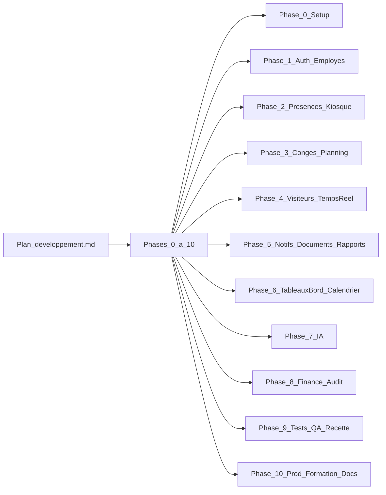

## Plan de développement détaillé — Ô Canada

Basé sur les documents existants :

- **Plan de développement** : `[C:\ocanada\docs\plan_developpement.md](C:\ocanada\docs\plan_developpement.md)`
- **Spécifications fonctionnelles détaillées (SFD)** : `[C:\ocanada\docs\Specifications_Fonctionnelles_OCanada_v1.0.md](C:\ocanada\docs\Specifications_Fonctionnelles_OCanada_v1.0.md)`
- **Architecture technique** : `[C:\ocanada\docs\architecture_technique.md](C:\ocanada\docs\architecture_technique.md)`
- **Charte graphique** : `[C:\ocanada\docs\charte_graphique.md](C:\ocanada\docs\charte_graphique.md)`
- **Guide sécurité & conformité** : `[C:\ocanada\docs\guide_securite_conformite.md](C:\ocanada\docs\guide_securite_conformite.md)`

### 1. Vision globale et méthode

- **Approche**
  - Développement itératif par **phases 0 à 10**, chacune livrant un ensemble de fonctionnalités testables.
  - Chaque phase se termine par : refactor léger, revues de code, tests ciblés, mise à jour de la documentation technique.
- **Découpage**
  - **Épics = Phases** (0: Setup, 1: Auth/Employés, 2: Présences/Kiosque, etc.).
  - **User stories** et tâches techniques dérivées directement des sections T*.x du plan actuel.
- **Flux de livraison**
  - Travail sur branches `feature/phase-N-`*, merge dans `develop` après revue, jalons J0–J10 synchronisés avec les démos client.

### 2. Environnement, standards et outillage

- **Environnement technique**
  - Installer et configurer : PHP 8.2+, MySQL 8, Composer 2, serveur local (php spark serve ou stack WAMP/Laragon) conformément au tableau §2.1 du plan.
  - Créer le dépôt Git (même si local au départ), avec branches `main`, `develop` et branches de phase.
- **Standards de code**
  - PHP : PSR‑12, `declare(strict_types=1)`, docblocks PHPDoc sur contrôleurs et modèles, requêtes via Query Builder / requêtes préparées.
  - JS : ES6+, `fetch` + `async/await`, CSRF sur tous les POST, pas de librairies non listées.
- **Sécurité et conformité**
  - Appliquer dès la Phase 0 les règles du `[guide_securite_conformite.md](C:\ocanada\docs\guide_securite_conformite.md)` (hash bcrypt, CSRF, XSS, contrôle d’accès double niveau, journal d’audit).

### 3. Détail par phase de développement

#### 3.1 Phase 0 — Setup & Infrastructure (1 semaine)

- **Objectifs**
  - Avoir un squelette CI4 opérationnel, base de données complète (migrations + seeders), layouts principaux, filtres de sécurité et helpers communs.
- **Travail technique**
  - Initialiser le projet CI4 via Composer, configurer `.env`, timezone, baseURL, connexion MySQL (`ocanada_db`), mode strict MySQL.
  - Implémenter les 8 migrations décrites (utilisateurs, employes, presences/shifts, conges/soldes, visiteurs, notifications/documents, jours_feries/config_systeme, audit_log), avec indexation stratégique.
  - Implémenter le `InitialDataSeeder` (jours fériés, `config_systeme`, shift par défaut, compte admin initial) et vérifier l’idempotence.
  - Structurer l’arborescence CI4 (`app/Controllers`, `Models`, `Views`, `Libraries`, `Filters`, `Helpers`, `Database/Migrations`, `Database/Seeds`, `public/assets`, `storage/uploads/`*).
  - Intégrer Bootstrap 5, Bootstrap Icons, fonts Inter/Roboto Mono, créer `public/assets/css/ocanada.css` en appliquant les blocs de variables/sidebar/topbar/kiosque/chatbot/print de la charte graphique.
  - Créer les 3 layouts principaux (`layouts/main.php`, `layouts/kiosque.php`, `layouts/auth.php`) et les composants (`sidebar_`*, `topbar`, `kpi_card`, `pagination`, `chatbot` placeholder).
  - Implémenter `BaseController`, `AuthFilter`, `RoleFilter`, `KiosqueIPFilter`, configuration CSRF dans `Filters.php`, pages d’erreur 403/404/500 stylées.
  - Mettre en place `AuditLogModel` et un helper centralisé de journalisation (`AuditLogModel::log`) appelé déjà par AuthController.
- **Qualité / validations**
  - Accès à une page de test via navigateur, DB migrée, seeders exécutés, filtres CI4 testés sur une route de démonstration.

#### 3.2 Phase 1 — Authentification & Gestion des employés (2 semaines)

- **Semaine 1 : Authentification & sécurité**
  - Implémenter `AuthController` (`/login`, `/logout`, `forgotPassword`, `resetPassword`) conformément aux SFD (tentatives, blocage 15 min, tokens de reset, messages génériques).
  - Définir les routes publiques et les premières routes protégées (admin/employé/agent) avec filtres adéquats.
  - Créer les vues `auth/login`, `auth/forgot_password`, `auth/reset_password` suivant la charte (page centrée, fond dégradé, carte).
  - Mettre en place la politique de sessions (config App.php), encodage systématique des sorties, début du journal d’audit (CONNEXION, ECHEC_CONNEXION, DECONNEXION).
- **Semaine 2 : Gestion des employés**
  - Implémenter `EmployeModel`, `UtilisateurModel`, logique de génération de matricule, calcul d’ancienneté.
  - Créer `Admin/EmployeesController` (index/liste filtrée, create/store wizard 3 étapes, show, edit/update, deactivate) et les vues correspondantes.
  - Sur `store` : créer employé, utilisateur, init solde de congés (via `SoldeCongeModel::initForEmployee()`), journaliser `CREATION_EMPLOYE`.
  - Sur `update`/`deactivate` : journaliser avant/après pour champs sensibles, gérer la désactivation cohérente avec AuthFilter.
  - Implémenter la page profil utilisateur (tous rôles) pour changement mot de passe et PIN kiosque en s’appuyant sur les règles de sécurité.
- **Tests / livrables**
  - Tests manuels de connexion/déconnexion, blocage après 5 tentatives, création/modification/désactivation d’un employé, visibilité des données par rôle.

#### 3.3 Phase 2 — Présences & Mode Kiosque (2 semaines)

- **Semaine 1 : Kiosque**
  - Implémenter `KiosqueController` (index, `pointArrivee`, `pointDepart`), layout kiosque, vue `kiosque/index` (fond bleu nuit, horloge temps réel, boutons surdimensionnés, zone de confirmation).
  - Implémenter la logique de pointage (identification employé, vérification PIN, fenêtres horaires, détection doublons, statut présent/retard via `PresenceCalculator`, blocage PIN après 3 erreurs, journalisation `POINTAGE` et `ECHEC_PIN_KIOSQUE`).
  - Finaliser le `KiosqueIPFilter` avec lecture de `ip_kiosque_autorisees` (config) + journalisation `ACCES_NON_AUTORISE`.
- **Semaine 2 : Gestion des présences côté admin/employé**
  - Implémenter `PresenceModel` (getByDate, getByEmploye, stats, markAbsences) + `PresenceCalculator`.
  - Créer `Admin/PresencesController` (vue quotidienne, historique, correction manuelle, stats mensuelles) et les vues `presences/today`, `history`, `stats`.
  - Créer la vue `employe/presences` (présences personnelles + stats du mois) avec codes couleur.
  - Implémenter la Command CI4 `ocanada:mark-absences` + configuration CRON côté dev/test.
- **Tests / livrables**
  - Scénarios complets de pointage, calcul retard, correction manuelle, simulation du CRON, affichage côté employé et admin.

#### 3.4 Phase 3 — Congés & Planning (2 semaines)

- **Semaine 1 : Congés**
  - Implémenter `SoldeCongeModel`, `CongeModel`, `WorkingDaysCalculator`, règles OHADA (ancienneté, majoration, prorata, congé maternité non décompté).
  - Implémenter `Employee/LeaveController` (formulaire de demande, calcul jours ouvrables via AJAX, validations de chevauchement/solde) et vues `employe/conges`.
  - Implémenter `Admin/LeaveController` (liste, fiche, approbation/refus/annulation, gestion des soldes, historiques, notifications) et vues `admin/conges`.
  - Mettre en place le CRON `ocanada:pending-leaves` (notifications demandes en attente > 48h).
- **Semaine 2 : Planning & Shifts**
  - Implémenter `ShiftModel`, `AffectationShiftModel` et les écrans de création/gestion des shifts et affectations.
  - Implémenter `Admin/PlanningController` (calendrier hebdo, données JSON, affichage des présences réelles) et `employe/planning`.
  - Intégrer les shifts dans les calculs de retard/statut dans `PresenceCalculator` et dans les vues.
- **Tests / livrables**
  - Cas de calcul jours ouvrables (week‑end/jours fériés), scénarios de soumission/approbation/refus/annulation, modification manuelle de solde, cohérence planning → présences.

#### 3.5 Phase 4 — Visiteurs & Vue temps réel (1,5 semaine)

- **Visiteurs**
  - Implémenter `VisiteurModel` (badge, historiques, clôture automatique), `VisitorController` (register/store, checkout, history, badge) pour ADMIN/AGENT.
  - Créer les vues d’enregistrement, liste présents, historique, badge + intégration de `qrcode.js` local pour génération du QR.
  - Implémenter la Command `ocanada:close-visits` (fermeture à 23h59) + notifications visiteur long (`NOTIF_VISITEUR_LONG`).
- **Vue temps réel + tableau de bord agent**
  - Implémenter `RealtimeController` + vue partagée `shared/realtime` (sections employés présents, visiteurs présents, absents, actualisation AJAX périodique).
  - Implémenter `Agent/DashboardController` qui redirige vers la vue temps réel et configurer la navigation agent.
- **Tests / livrables**
  - Enregistrement complet d’une visite, impression badge, durées en JS, simulation du script de clôture, vue unifiée pour admin et agent.

#### 3.6 Phase 5 — Notifications, Documents, Rapports (2 semaines)

- **Semaine 1 : Notifications & Documents**
  - Implémenter `NotificationModel` + `NotificationService` et intégrer les appels dans tous les modules (congés, présences/CRON, visiteurs, contrats, etc.).
  - Implémenter `NotificationsController` (badge cloche, liste, marquer lu/tout lire, endpoints AJAX) et les vues associées.
  - Implémenter `DocumentRHModel`, `Admin/DocumentsController`, `Employee/DocumentsController` + vues (liste, upload, téléchargement, suppression) en appliquant les règles d’accès et de validation de fichiers.
- **Semaine 2 : Rapports**
  - Installer DOMPDF/TCPDF, créer un template PDF générique (logo, en‑tête, pied de page).
  - Implémenter `Admin/ReportsController` et les gabarits HTML pour les 4 rapports (présences, congés, journal visiteurs, absentéisme) + exports CSV.
  - Journaliser systématiquement `GENERATION_RAPPORT` dans `audit_log`.
  - Implémenter la Command `ocanada:check-contracts` pour les contrats CDD.

#### 3.7 Phase 6 — Tableaux de bord & Calendrier camerounais (1,5 semaine)

- **Tableaux de bord**
  - Implémenter `Admin/DashboardController`, `Employee/DashboardController`, `Agent/DashboardController` et vues `dashboard` respectives (KPIs, graphiques Chart.js, mini‑calendrier, liens rapides).
  - Intégrer les statistiques agrégées depuis les modèles (présences, visites, congés, notifications).
- **Calendrier camerounais & OHADA**
  - Implémenter la gestion CRUD des jours fériés dans `ConfigController` + vues `config/holidays`.
  - Finaliser/valider les calculs OHADA dans `WorkingDaysCalculator` et `SoldeCongeModel` avec tests unitaires.

#### 3.8 Phase 7 — Modules IA (assistant congé + chatbot RH) (1,5 semaine)

- **Infrastructure IA**
  - Implémenter `AnthropicClient` et `RateLimiter` selon l’architecture technique (lecture clé API depuis `config_systeme`, appels sécurisés, gestion erreurs/timeouts).
  - Créer l’interface d’admin pour saisir/modifier la clé API.
- **Assistant de rédaction de congé**
  - Implémenter l’endpoint `/ia/assistant-conge` dans `AIController`, le panneau UI sur le formulaire de congé et l’appel AJAX avec gestion des erreurs.
  - Construire le prompt système conforme aux SFD (français, ton formel, pas d’invention, limitation tokens), implémenter les limites 3 appels/heure.
- **Chatbot RH**
  - Implémenter l’endpoint `/ia/chatbot` dans `AIController`, récupération des données contextuelles par rôle, construction du prompt système et envoi de l’historique de conversation.
  - Implémenter le panneau chat flottant (icône, overlay, messages alternés, indicateur typing), historique en JS (limité), rate‑limit 20 messages/heure.

#### 3.9 Phase 8 — Tableau de bord financier & Journal d’audit (1 semaine)

- **Finance**
  - Implémenter `Admin/FinanceController` et la vue correspondante (sélecteur de période, indicateurs coût absentéisme, impact retards, graphiques de comparaison, classement employés).
  - S’assurer que les salaires individuels ne sont jamais exposés (seules les agrégations).
- **Journal d’audit**
  - Implémenter `Admin/AuditController` (liste paginée, filtres, détail avant/après, export CSV) et la vue.
  - Vérifier la couverture des 21 types d’événements et l’absence de toute possibilité de modification/suppression d’entrées.

#### 3.10 Phase 9 — Tests, QA, Recette client (2 semaines)

- **Automatisation minimale**
  - Écrire les tests unitaires PHP (PHPUnit/CI4) pour : `PresenceCalculator`, `WorkingDaysCalculator`, `SoldeCongeModel` (calcul OHADA), logique de jours ouvrables, quelques modèles clés (markAbsences, closeVisits).
- **Tests d’intégration et fonctionnels**
  - Scénarios bout‑en‑bout : pointage complet, congé (soumission → approbation → solde), visiteur (enregistrement → sortie), génération de rapports, flux IA.
  - Vérifier les règles de sécurité (SQLi, CSRF, XSS, contrôle d’accès, uploads) en suivant la checklist du guide sécurité.
- **Recette client**
  - Préparer un jeu de données de test réaliste, exécuter la checklist de recette (plan de développement §3 Phase 9), corriger les anomalies jusqu’à stabilisation.

#### 3.11 Phase 10 — Déploiement, formation, documentation (1 semaine)

- **Déploiement**
  - Suivre la procédure de déploiement de l’architecture technique (composer install, migrations, seeders, config serveur web, HTTPS, CRONs).
  - Appliquer la checklist de sécurité pré‑production (guide sécurité section 10).
- **Configuration initiale**
  - Saisir IP kiosque, clé API Anthropic, jours fériés de l’année, création des comptes initiaux.
- **Documentation & formation**
  - Rédiger :
    - Manuel utilisateur par rôle (captures d’écran, scénarios clés).
    - Guide administrateur technique (sauvegardes, CRON, mises à jour, résolution incidents).
  - Organiser la session de formation et la période de stabilisation post‑déploiement.

### 4. Dimensions transverses

- **Sécurité & conformité**
  - Intégrer systématiquement les contrôles du `[guide_sécurité](C:\ocanada\docs\guide_securite_conformite.md)` lors du développement des modules (auth, kiosque, fichiers, IA, audit).
- **UX / UI**
  - Se référer à la `[charte_graphique](C:\ocanada\docs\charte_graphique.md)` pour tous les écrans : palettes, typographie, composants, responsive.
- **Performance & maintenance**
  - S’appuyer sur les index prévus, surveiller les requêtes lourdes (rapports, tableaux de bord), factoriser les librairies métier (calculs, notifications, IA) pour limiter la duplication.

### 5. Rythme, jalons et gestion de projet

- **Calendrier de référence**
  - Conserver les jalons J0–J10 du plan initial (S1 à S17), chaque jalon correspondant à une démo client ou à un jalon technique.
- **Suivi**
  - Tenir un backlog (par exemple dans un board Kanban) structuré par phases/épics, avec priorisation stricte des fonctionnalités critiques.
  - Geler les spécifications après la Phase 0, tout changement formel devant passer par une mise à jour des SFD et un ajustement du planning.

